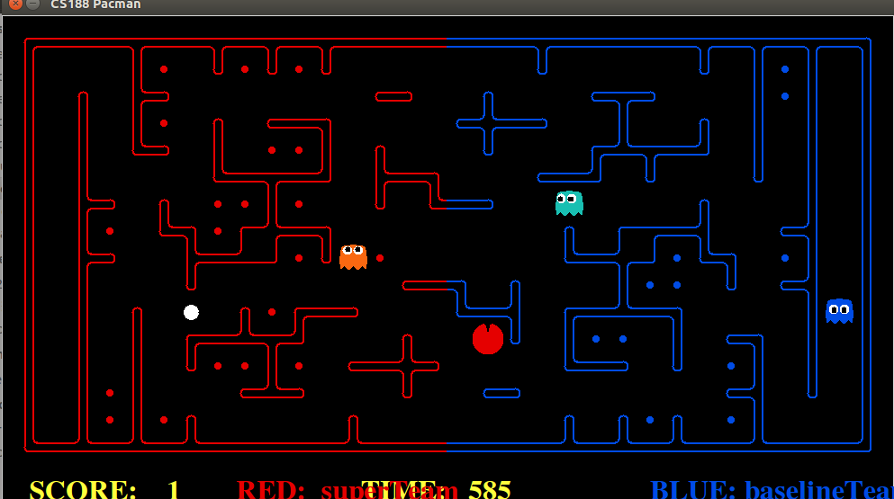

# Berkeley pacmanCTF using Reinforcement Learning

## Training

### Training together
Train for 5 times and play for 2 times, the weights will store in *.train

`python capture.py -r superTeam -x 5 -n 7`

## Testing
If need to use pretrain weights, need to uncomment some lines in `__init__`, otherwise, best weight is use

Play against baselineTeam

`python capture.py -r superTeam -b baselineTeam` 

